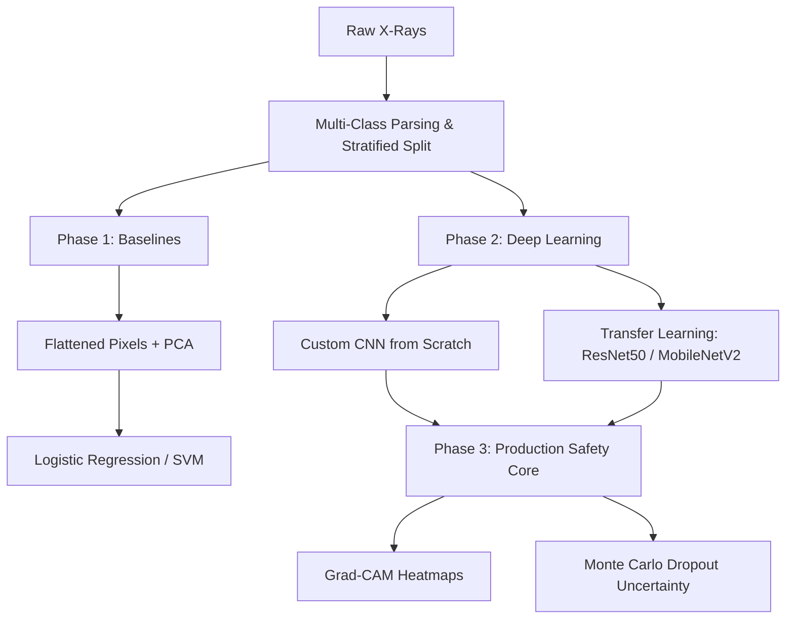

# Pediatric Pneumonia Diagnostic & Triage Pipeline (Explainable Computer Vision)

**Course:** UC Berkeley MIDS - DATASCI 207 (Applied Machine Learning)

---

## Project Overview & Motivation

Pneumonia remains the leading infectious cause of death in children under five worldwide, accounting for over 740,000 pediatric deaths annually. In clinical settings, the key diagnostic challenge is not merely detecting the presence of pneumonia, but accurately distinguishing between **bacterial** and **viral** etiologies. This distinction has profound clinical implications for **antibiotic stewardship**:
* **Bacterial pneumonia** requires immediate antibiotic intervention.
* **Viral pneumonia** is treated supportively, and unnecessary antibiotic use drives global resistance and subjects pediatric patients to secondary risks.

### Why Standard Adult Models Fail
Most commercial chest X-ray classifiers are trained on adult cohorts (e.g., NIH ChestX-ray14). However, pediatric thoracic anatomy differs radically from adults in terms of bone density, thymus size, lung compliance, and rapid developmental changes. Standard models often misidentify the normal thymus gland or typical pediatric bronchial markings as consolidations, leading to high false-positive rates. This project delivers a specialized diagnostic pipeline designed specifically for pediatric chest anatomy.

### The "Why" - Core Unique Angles
1. **Pediatric-Specific Anatomy:** Tailored directly to pediatric structures to minimize anatomical false positives.
2. **Clinical Safety & Interpretability:** Integrates **Grad-CAM** (Gradient-weighted Class Activation Mapping) for spatial localization of pathological consolidations alongside **Monte Carlo Dropout** to estimate epistemic (model) uncertainty, allowing the pipeline to reject ambiguous scans for human triage.
3. **Robustness & Domain Adaptation:** Benchmarked using **Cross-Dataset Domain Stress Testing** to evaluate model generalization across different scanners and hospital protocols.

---

## Dataset & Preprocessing Pipeline

The primary dataset consists of pediatric chest X-rays from the Guangzhou Women and Children's Medical Center. 

### Multi-Class Etiology Extraction
While the original dataset is labeled as binary (`NORMAL` vs `PNEUMONIA`), we extract fine-grained diagnostic classes by parsing the metadata embedded in the filename strings inside the pneumonia subdirectories:
* **Normal Class:** Sourced from the `NORMAL` raw directories.
* **Bacterial Class:** Sourced from files containing the substring `_bacteria_`.
* **Viral Class:** Sourced from files containing the substring `_virus_`.

### Stratified Split Strategy
The default Kaggle validation set contains only 16 images, which creates severe validation instability. To address this, we aggregate the entire dataset and execute a mathematically stable **70/15/15 train/validation/test split**. This split is strictly **stratified** by the multi-class labels to maintain identical class ratios across all three subsets:
* **Train Set (70%):** Model parameter optimization.
* **Validation Set (15%):** Hyperparameter tuning and early stopping execution.
* **Test Set (15%):** Unseen final evaluation.

### Addressing Class Imbalance
Bacterial and viral cases outnumber normal cases. We resolve this in the preprocessing step via **Targeted Data Augmentation** (including horizontal flips, slight rotations, and zooms) applied dynamically during training to synthesize underrepresented features and prevent model bias.

---

## Analytical Roadmap & Methodology



### Phase 1: Baseline Machine Learning
* **Methodology:** We flatten 2D X-ray images, apply Principal Component Analysis (PCA) for dimensionality reduction, and feed them into **Logistic Regression** and **Support Vector Machine (SVM)** classifiers.
* **Objective:** Establish a non-neural benchmark to measure the marginal utility of deep learning.

### Phase 2: Advanced Deep Learning
* **Custom CNN Architecture:** Built from scratch to learn pediatric-specific low-level spatial features.
* **Transfer Learning:** Leveraging **ResNet50** and **MobileNetV2** architectures pre-trained on ImageNet. We freeze the base feature extractors and attach a custom dense classification head to adapt to the three target categories.
* **Hardware Acceleration:** The training scripts utilize PyTorch's MPS backend (Metal Performance Shaders) for local acceleration on Apple Silicon (or fall back to CUDA/CPU).

### Phase 3: Clinical Explainability & Safety Core
* **Spatial Localization (Grad-CAM):** Computes gradients of the score for each class with respect to the last convolutional layer, generating heatmaps highlighting the exact regions (e.g., lobar vs. interstitial patterns) the model used for classification.
* **Epistemic Uncertainty (Monte Carlo Dropout):** Keeps dropout active during inference to generate a distribution of predictions. If the variance of these predictions exceeds a threshold (signaling high ambiguity), the scan is flagged as "High Uncertainty" and safely routed to a human radiologist.

---

## Evaluation Framework

Naive classification accuracy is a dangerous metric for clinical triage. A model could achieve high accuracy while failing to detect bacterial infections (critical false negatives). 

### Primary Optimization Metrics:
1. **Recall / Sensitivity (Bacterial & Viral Classes):** Minimizing false negatives is paramount; missing a bacterial infection risks patient safety, while missing a viral infection leads to inappropriate discharge.
2. **Macro-Averaged F1-Score:** Balances precision and recall across all classes equally, ensuring the model performs well on the minority classes (Normal) and is not dominated by the majority classes.
3. **AUROC (Area Under ROC):** Measures the discriminative capacity of the model across different threshold settings.

---

## Local Environment Setup

### 1. Prerequisites
Ensure you have **Python 3.11** and `virtualenv` or `conda` installed.

### 2. Setup Virtual Environment
Run the following commands in your terminal to set up a clean workspace:

```bash
# Clone the repository
git clone https://github.com/yourusername/pneumonia-diagnostic-pipeline.git
cd pneumonia-diagnostic-pipeline

# Create a virtual environment
python3 -m venv py311_env

# Activate the virtual environment
source py311_env/bin/activate

# Upgrade pip
pip install --upgrade pip
```

### 3. Install Dependencies
Install the required packages:
```bash
pip install -r requirements.txt
```

### 4. Download and Prepare Data
Place your downloaded Kaggle dataset under `data/raw/` and execute the stratified splitting script:
```bash
python src/preprocess_splits.py
```
This script will parse the filenames, partition the images, and place them in the correct `data/processed/{train,val,test}` directories.
